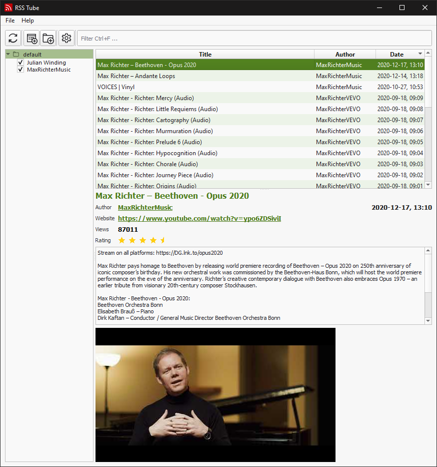

# RSS Tube


A simple desktop application for Youtube, based on RSS feeds.


Dark theme                                                            |  Light theme
:--------------------------------------------------------------------:|:---------------------------------------------------------------------:
  |  


## Download

[Download the latest release.](https://github.com/seird/rsstube/releases/latest)


## Install

Get the source and install the requirements:

```
$ git clone https://github.com/seird/rsstube
$ cd rsstube
$ pip install -r requirements.txt
```

### Run from source

```
$ python entry_point.py
```

### Create a pyinstaller executable

```
$ pip install pyinstaller
$ pyinstaller rss-tube.spec
```
An executable is created at `dist/rsstube/rsstube`.

### Create a deb package

```
$ make build

# or install

$ sudo make install
```

### (Inno setup (Windows))

Create an installer for windows with inno setup:

```
$ iscc rss-tube.iss
```


## Requirements

- Python >= 3.6
- lxml
- PyQt5
- requests
- schedule
- (mpv + youtube-dl visible in your path, to directly play videos)
